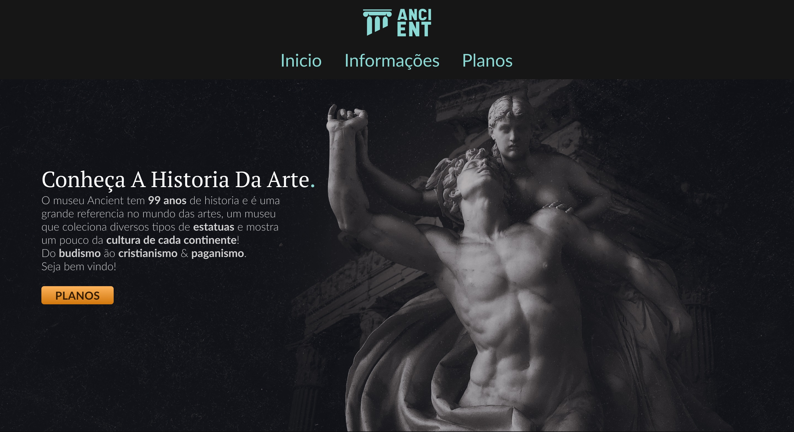

  
Buy your museum ticket with us!   Compre seu ingresso para o museu com a gente!

    

      <a href="https://paulopbi.github.io/ancient/"> Website </a> •
      <a href="#en">English</a> •
      <a href="#pt">Português</a> •
      <a href="https://www.instagram.com/paulopbi_/">Instagram</a> •
      <a href="https://www.linkedin.com/in/paulopbi/">Linkedin</a> •
      <a href="https://github.com/paulopbi">Github</a> 
    

<h1>What is Acient project?</h1>

  <h2>English</h1> 

Ancient is a small project it's about a statue museum website you can see the details about the museum like the plans to buy, which types of statues we have here.  
This project is full responsive for mobile devices, tablets, pc and tv.

This project was made with: Figma, Html, Css

**In this project i learned:**

* Figma 
* UI Design
* Flexbox
* Responsive design
* Media queries
* Git & Github
* Github Pages

<h1>O que é o projeto Ancient?</h1>

  <h2>Português</h2>

 

 

Ancient é um pequeno projeto sobre um site de museu de estátuas você pode ver os detalhes sobre o museu como os card de compras, que tipos de estátuas temos aqui.  
Este projeto é totalmente responsivo para dispositivos móveis, tablets, pc e tv.

Esse projeto foi feito com: Figma, Html, Css

**O que eu aprendi:**

* Figma 
* UI Design
* Flexbox
* Design responsivo
* Media queries
* Git & Github
* Github Pages

<h1>Layout Figma</h1>

<a href="#top">Back to the top ↑</a>

