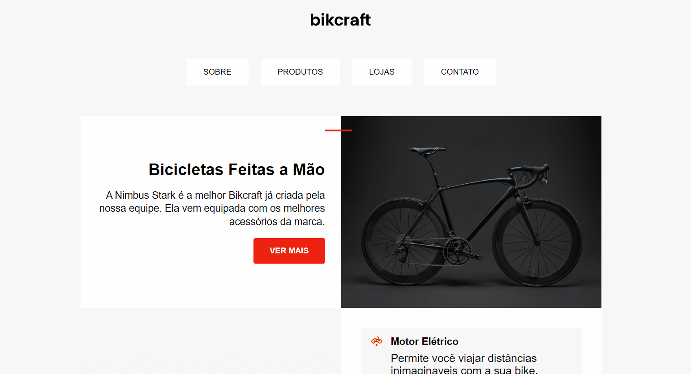
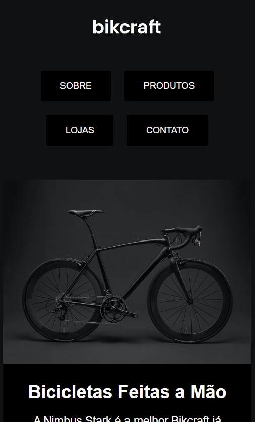

 
<a href="https://paulopbi.github.io/bikcraft-landing-page/" target="_blank">
<strong>Site completo »</strong>
</a>

Landing Page da contando detalhes sobre a bicicletas elétrica "Star Nimbus".

<a href="https://www.linkedin.com/in/paulopbi/" target="_blank">Linkedin</a> •
<a href="https://github.com/paulopbi" target="_blank">Github</a> •
<a href="https://www.behance.net/paulopbi" target="_blank">Behance</a> •
<a href="https://github.com/paulopbi/bikcraft" target="_blank">Projeto Bikcraft</a>

## Bikcraft landing page

  

> Gif de demonstração desktop.

## Sobre
A Nimbus Stark é a melhor bikcraft já criada pela nossa equipe. Ela vem equipada com os melhores acessórios da marca.

O que essa bikcraft tem?
- Motor Elétrico: Permite você viajar distâncias inimaginaveis com a sua bike.

- 40Km/h: A mais rápida bicicleta elétrica disponível hoje no mercado.

- Rastreador: e sistema anti-furto para garantir o seu sossego.

## O projeto
O código do site foi todo feito com **html**, **css** puro, a interface e bem simples, mas completa, sendo 100% responsivo a todos os tamanhos de telas, havendo mudança de cores para temas dark ou light (ele sera ativado de acordo com a preferência do seu navegador) e outras coisas.

## Modo light / dark e responsividade

O projeto possui a feature de dark / light mode, ele e ativado de acordo com as preferência do seu navegador, nessa demo você pode ver um pouco mais da versão mobile também!

> Gif de demonstração na versao mobile.

## Projeto principal

Esse projeto e faz parte do projeto bikcraft que e o principal, <a href="https://paulopbi.github.io/bikcraft/">clique aqui para ver o projeto</a>.

## Tecnologias utilizadas

## Contato

Meu email: paulovictordev16@gmail.com

Muito obrigado por ver o meu projeto!

 

(<a href="#top">Voltar ao inicio</a>)
