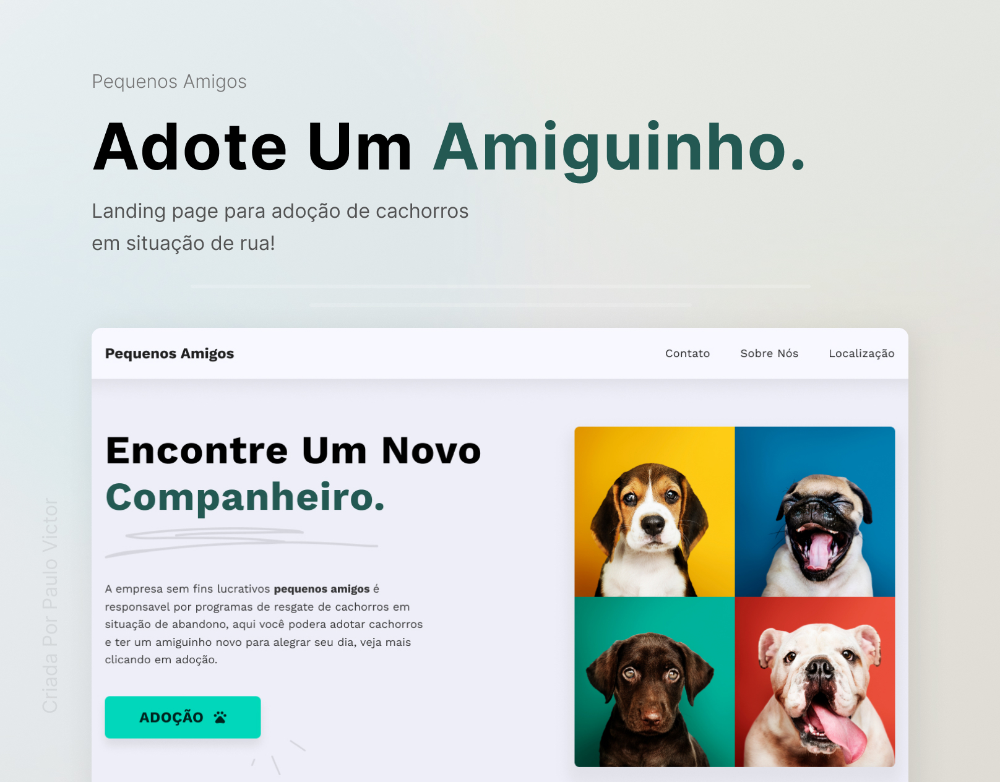

<h2 align="center">
Informações
</h2>

<a href="https://paulopbi.github.io/pequenos-amigos/" target="_blank">Site Completo</a> •
<a href="https://www.linkedin.com/in/paulopbi/" target="_blank">Linkedin</a> •
<a href="https://github.com/paulopbi" target="_blank">Github</a> •
<a href="https://www.behance.net/paulopbi" target="_blank">Behance</a> •
<a href="https://www.instagram.com/paulopbi_/" target="_blank">Instagram</a> 

 

# Pequenos Amigos

Pequenos amigos é uma landing page para adoção de cães.

 

# Sobre

Este website eu criei para treinar meu **Ui Design** e **Desenvolvimento Frontend**.
Neste projeto o layout, wireframe, foto de capa e etc, foram feitos no figma no Figma e na parte de Frontend foi usado Html e Css puro.
  
Habilidades aprendidas com esse projeto:

- Media query (responsividade)
- Css grid
- Flexbox
- Semantica
- Figma (UI Design)
- Wireframes
- Teoria das cores
    

Você pode ver o site completo clicando no link "Site Completo" no topo dessa documentação.
  

(<a href="#top">Voltar ao inicio</a>)

