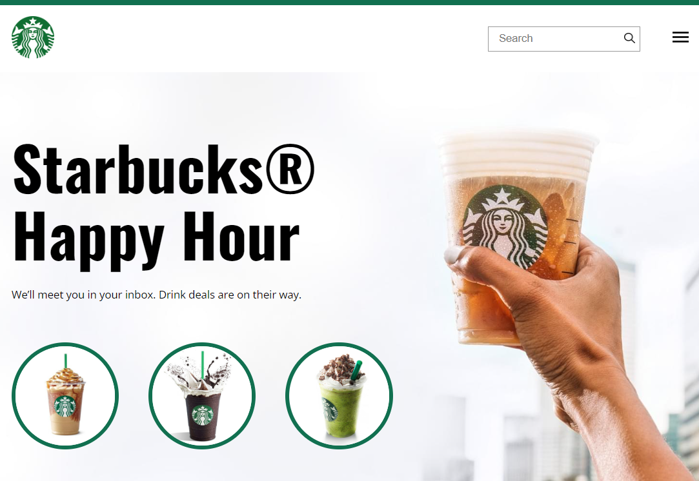

# Projeto Starbucks

<a href="https://www.linkedin.com/in/paulopbi/" target="_blank">Linkedin </a> •
<a href="https://www.instagram.com/paulopbi_/" target="_blank">Instagram</a> •
<a href="https://github.com/paulopbi" target="_blank">Github</a> •
<a href="https://paulopbi.github.io/starbucks/" target="_blank">Página Completa</a> 

Um website inspirado na marca starbucks.

## Sobre

Projeto feito usando o layout da internet, utilizando css grid e flexbox para alinhamento de colunas e linhas e totalmente responsivo para celulares & tablets, acesse o projeto e veja!

 

OBRIGADO POR VER O MEU PROJETO.
