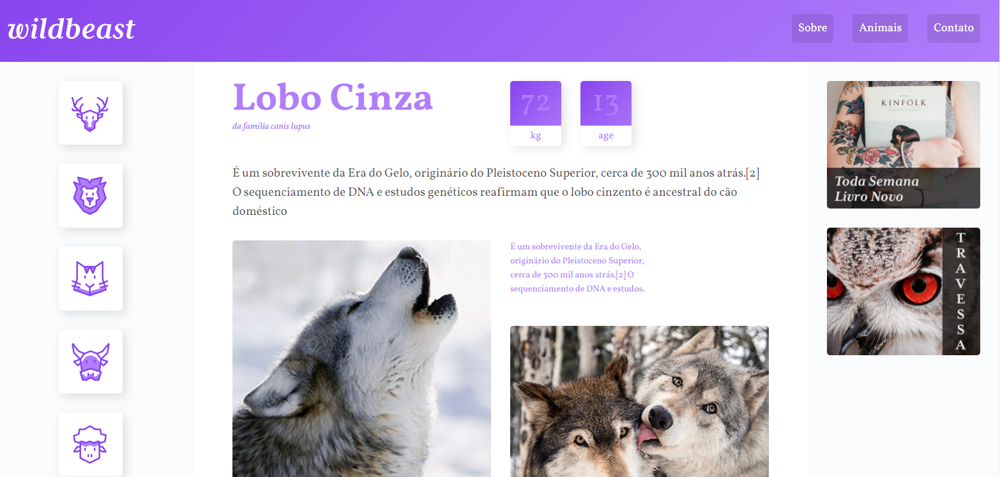
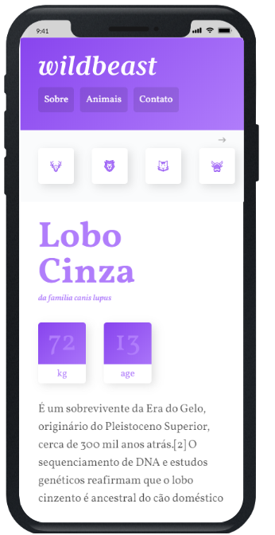

<h1 align="center">WildBeast</h1>

<h2 align="center">Redes Sociais</h2>

<h3 align="center"><a href="https://www.linkedin.com/in/paulopbi/">
Linkedin 
</a> •
<a href="https://www.instagram.com/paulopbi_/">
Instagram 
</a> •
<a href="https://github.com/paulopbi">
Github
</a> 
</h3>

 

<h1 align="center">Sobre o Projeto</h1>

<h3 align="left">O projeto wildbeast foi o site pratico feito ao termino do curso Css grid layout do Origamid, com esse curso pude ver bastante sobre o grid layout e ter novas formas alem do flex-box para construir sites responsivos e alinhados! Aprendi bastante nesse curso e vou aplicar os conhecimentos nos meus websites.</h3>

 

<h1 align="center">Nesse projeto eu aprendi</h1>

 

**Todo o Css Grid**  
**Design Responsivo / Media Query**

 

<a href="https://paulpbi.github.io/wildbeast/">Clique no texto para acessar o website</a>

 

