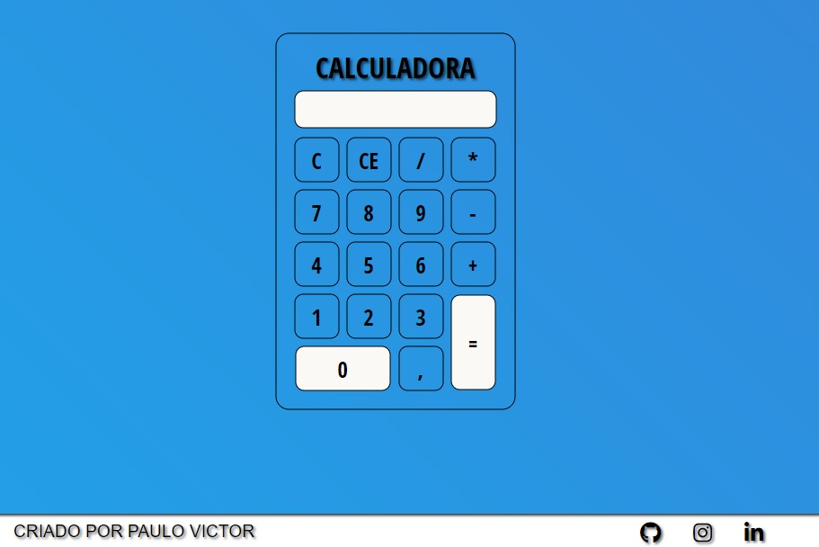

# Calculadora Javascript.

## Introdução

Nesse projeto foi desenvolvido uma calculadora simples e responsiva!

## tecnologias utilizadas:
  **(HTML, CSS, JAVASCRIPT)**

# Meu Aprendizado Nesse Projeto
* Tabelas
* Media Query
* Keyframes
* Git & Github
* Operações Matematicas com Javascript
* Trabalhar mais a Lógica
* Fundo dêgrade que se movimenta com keyframes
