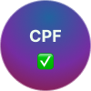
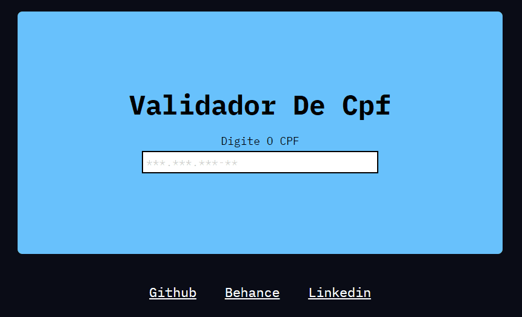

<!--LINKEDIN-->
  
<!--BEHANCE-->
  <a href="https://www.behance.net/paulopbi" target="_blank">
  
<!--INSTAGRAM-->
  
<!--GITHUB-->
  

  

  
 <h2 align="center">Validador De CPF</h2>
 
Utilize do Regex para validar o números dos cpfs inseridos

 <a href="https://paulopbi.github.io/validar-cpf/">
    <strong>Pagina Completa »</strong>
 </a>

 

### Sobre o projeto

Esse projeto foi feito com a inteção de estudar expressões regulares no Javascript como regex! O visual do site é bem simples, o principal objetivo é mostrar as funcionalidades da validação.

  

> Você digita o seu cpf no input e ele te mostrará se é valido ou não.

### Técnologias usadas

* 

* 

* 

(<a href="#topo">Voltar ao topo</a>)
