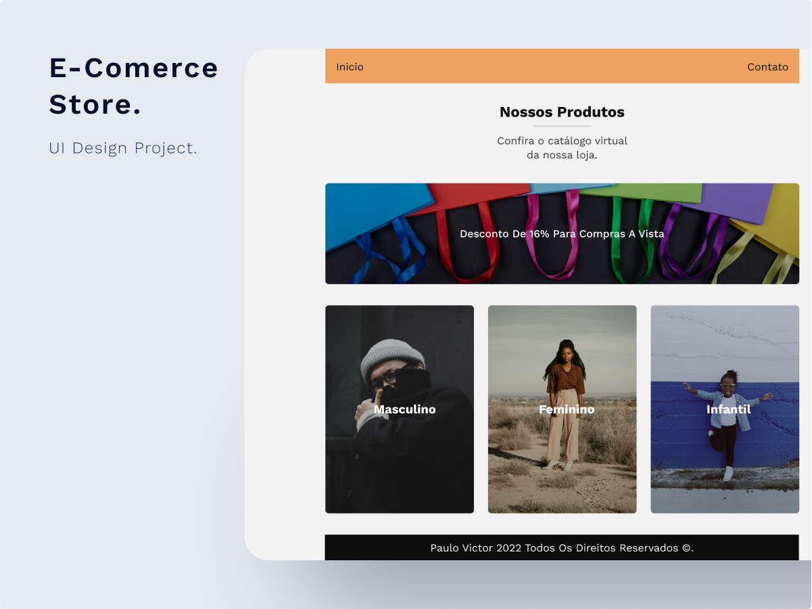

    

  <h1 align="center">E-Comerce Store</h3>

  

    Uma pequena loja virtual .
     
    <a href="https://paulopbi.github.io/e-comerce/" target="_blank">
      <strong>
      Clique aqui para ver o site completo »
      </strong> 
    </a>
     
    <a href="https://www.instagram.com/paulopbi_/" target="_blank">Instagram</a>
    •
    <a href="https://www.linkedin.com/in/paulopbi/" target="_blank">Linkedin</a>
    •
    <a href="https://www.behance.net/paulopbi" target="_blank">Behance</a> 
    •
    <a href="https://github.com/paulopbi" target="_blank">Github</a>
  

 

  

## Sobre o projeto

Uma página de e-comerce feito para praticar o javascript puro.  

O projeto é simples, consiste em uma vitrine/loja virtual, onde o usuario pode ver as categorias (apenas a categoria masculino tem conteudo), ver os produtos da aba masculino como camisa, oculos e terno.

## O que aprendi com esse projeto?

- Criação de modal
- Manipular data e hora pelo javascript
- Responsividade
- Css grid
- Uso de tags semanticas

## Técnologas utilizadas

O projeto foi **feito sem nenhuma biblioteca ou frameworks.**

- [HTML](https://developer.mozilla.org/pt-BR/docs/Web/HTML)
- [CSS](https://developer.mozilla.org/en-US/docs/Web/CSS)
- [JAVASCRIPT](https://developer.mozilla.org/en-US/docs/Web/JavaScript)

  

(<a href="#top">Voltar ao inicio</a>)

