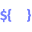
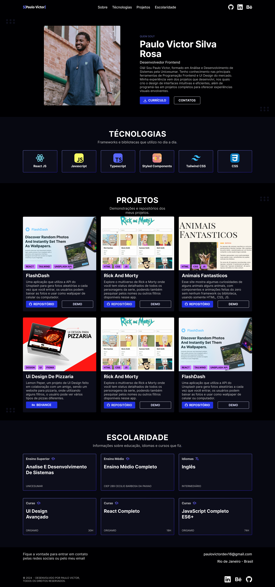

    
  
  <h3 align="center">Paulo Victor Portfolio</h3>

  

    <a href="https://www.linkedin.com/in/paulopbi/" target="_blank">Linkedin</a>
    ·
    <a href="https://github.com/paulopbi" target="_blank">Github</a>
    ·
    <a href="/LICENSE">License</a>
  

> **Legacy porfolio, i don't use this one anymore.**

Welcome to my portfolio!
Here, you’ll find a detailed showcase of my skills and projects as a **frontend developer** and **ui design**,
there are all my projects compiled, feel free to explore them.

### 👨🏾‍💻 Build With

- 
- 
- 
- 

**Tailwind** it have excellent support in building **responsive layouts**, which allowed me to develop the portfolio more efficiently and mobile first.  

Using **React**, I was able to **componentize** the entire project—organizing sections, buttons, and the navigation menu into separate files. This structure makes it easier to maintain the project and quickly address any issues that arise.  

And also I use **Motion** for animations.

### 🎨 Design Process

I handled the entire design process, starting with **sketches on paper**, then moving to **wireframes**, and finally reaching the completed version.
I chose the **Inter font** for this, because it's a modern and neutral **sans-serif** style font.
The **primary colors are blue**, with **purple as the secondary color**, creating an analogous color scheme.

You can check all my design process and style guide on Figma, just [**click here**](https://www.figma.com/design/8LpoYdQecW9xspjLaksY7R/Portfolio?m=auto&t=Q8CjFiHoPK3qlAVF-1).

  

### © License

Distributed under [_Creative Commons BY-NC 4.0 License_](/LICENSE).

### 📩 Contact

Email: paulovictordev16@gmail.com  
Linkedin: https://www.linkedin.com/in/paulopbi/  
Github: https://github.com/paulopbi  

(<a href="#readme-top">back to top</a>)

